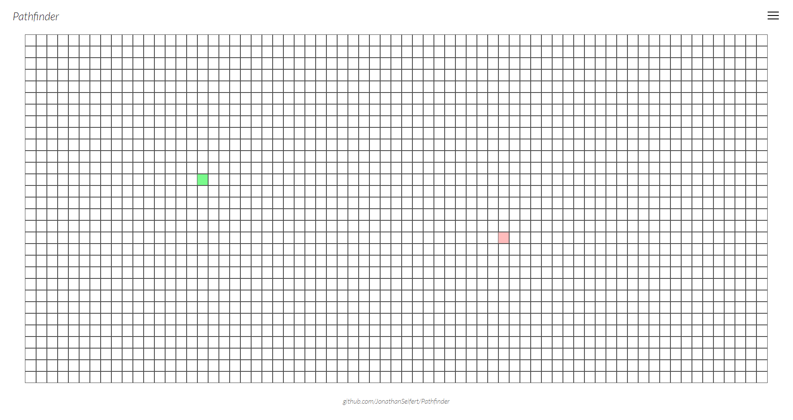
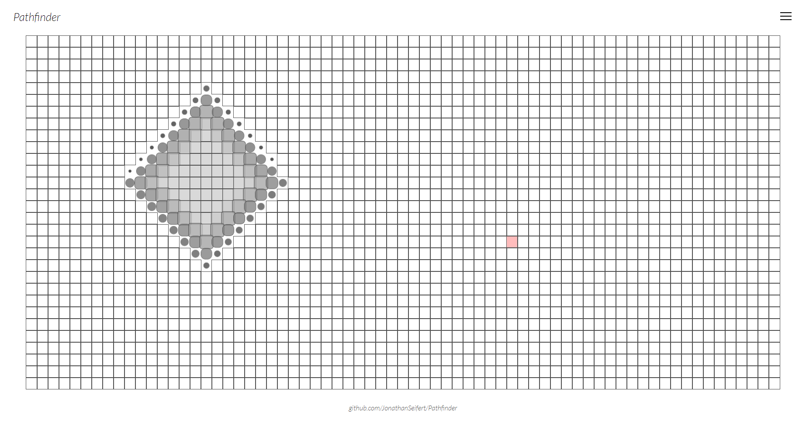
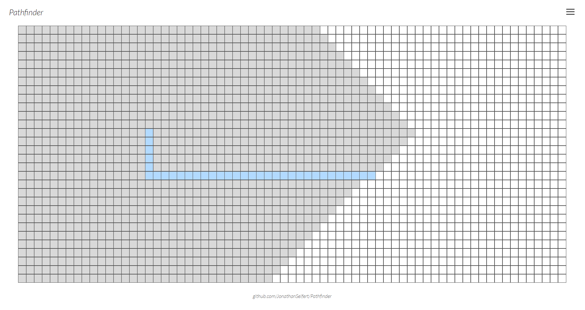
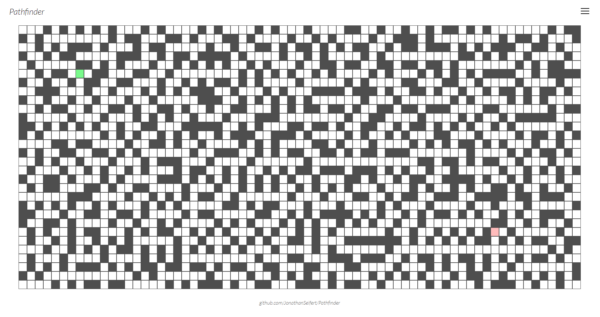
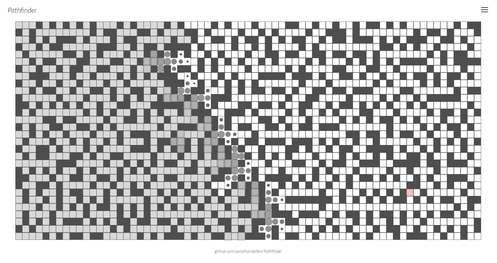
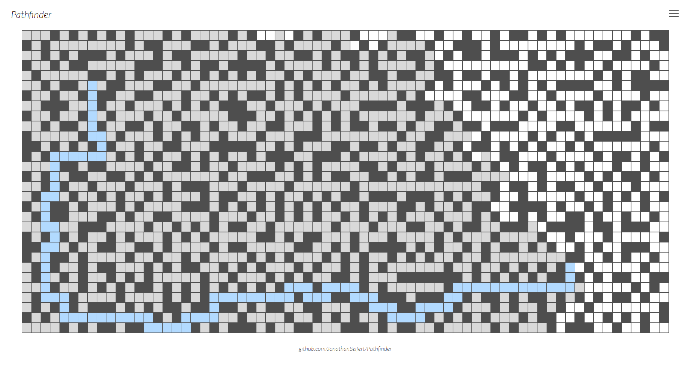

# Pathfinder

Bei diesem Projekt handelt es sich um eine React Single-Page-Applikation. In einem Gitter wird der kürzeste Weg zwischen zwei Punkten gesucht und anschließend visualisiert. Der Start- sowie Endpunkt sind dabei frei im Raster wählbar. Es besteht ebenfalls die Möglichkeit ein Irrgarten generieren zu lassen und in diesem den (kürzesten) Weg zwischen den beiden Punkten suchen zu lassen.

## Technologien
 - JavaScript
 - React
 - HTML
 - CSS

## Algorithmen
Zur Bestimmung des kürzesten Weges wurde [Dijkstra's Algorithmus](https://de.wikipedia.org/wiki/Dijkstra-Algorithmus) mittels JavaScript implementiert. Zur Generierung von Irrgärten wurde [Prim's Algorithmus](https://de.wikipedia.org/wiki/Algorithmus_von_Prim) in JavaScript umgesetzt.

## Screenshots

